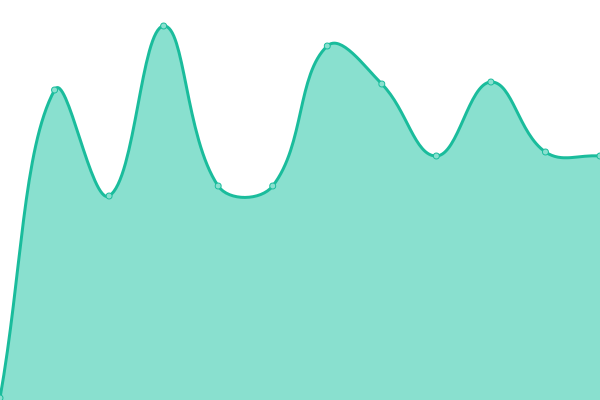

# [📈 Live Status](https://stefan-hoeltker-nextn.github.io/niko-uptime): <!--live status--> **🟩 All systems operational**

This repository contains the open-source uptime monitor and status page for [stefan-hoeltker-nextn](https://stefan-hoeltker-nextn.github.io/niko-uptime), powered by [Upptime](https://github.com/upptime/upptime).

With [Upptime](https://upptime.js.org), you can get your own unlimited and free uptime monitor and status page, powered entirely by a GitHub repository. We use [Issues](https://github.com/stefan-hoeltker-nextn/niko-uptime/issues) as incident reports, [Actions](https://github.com/stefan-hoeltker-nextn/niko-uptime/actions) as uptime monitors, and [Pages](https://stefan-hoeltker-nextn.github.io/niko-uptime) for the status page.

<!--start: status pages-->
<!-- This summary is generated by Upptime (https://github.com/upptime/upptime) -->
<!-- Do not edit this manually, your changes will be overwritten -->
<!-- prettier-ignore -->
| URL | Status | History | Response Time | Uptime |
| --- | ------ | ------- | ------------- | ------ |
|  [Frontend](https://niko.neuenhauser.de) | 🟩 Up | [frontend.yml](https://github.com/stefan-hoeltker-nextn/niko-uptime/commits/HEAD/history/frontend.yml) | 

 674ms
     
 | 

<a href="https://stefan-hoeltker-nextn.github.io/niko-uptime/history/frontend">100.00%</a>
    

|  [Keycloak](https://niko.neuenhauser.de/auth/realms/niko-prod) | 🟩 Up | [keycloak.yml](https://github.com/stefan-hoeltker-nextn/niko-uptime/commits/HEAD/history/keycloak.yml) | 

 128ms
     
 | 

<a href="https://stefan-hoeltker-nextn.github.io/niko-uptime/history/keycloak">100.00%</a>
    

|  [User API](https://niko.neuenhauser.de/api/user/q/health) | 🟩 Up | [user-api.yml](https://github.com/stefan-hoeltker-nextn/niko-uptime/commits/HEAD/history/user-api.yml) | 

 138ms
     
 | 

<a href="https://stefan-hoeltker-nextn.github.io/niko-uptime/history/user-api">100.00%</a>
    

|  [Notification API](https://niko.neuenhauser.de/api/notification/q/health) | 🟩 Up | [notification-api.yml](https://github.com/stefan-hoeltker-nextn/niko-uptime/commits/HEAD/history/notification-api.yml) | 

 130ms
     
 | 

<a href="https://stefan-hoeltker-nextn.github.io/niko-uptime/history/notification-api">100.00%</a>
    

|  [Mitarbeiter API](https://niko.neuenhauser.de/api/ma/q/health) | 🟩 Up | [mitarbeiter-api.yml](https://github.com/stefan-hoeltker-nextn/niko-uptime/commits/HEAD/history/mitarbeiter-api.yml) | 

 130ms
     
 | 

<a href="https://stefan-hoeltker-nextn.github.io/niko-uptime/history/mitarbeiter-api">100.00%</a>
    

|  [AZ API](https://niko.neuenhauser.de/api/az/q/health) | 🟩 Up | [az-api.yml](https://github.com/stefan-hoeltker-nextn/niko-uptime/commits/HEAD/history/az-api.yml) | 

 130ms
     
 | 

<a href="https://stefan-hoeltker-nextn.github.io/niko-uptime/history/az-api">100.00%</a>
    

|  [Geschaeftspartner Portal API](https://niko.neuenhauser.de/api/gpp/q/health) | 🟩 Up | [geschaeftspartner-portal-api.yml](https://github.com/stefan-hoeltker-nextn/niko-uptime/commits/HEAD/history/geschaeftspartner-portal-api.yml) | 

 131ms
     
 | 

<a href="https://stefan-hoeltker-nextn.github.io/niko-uptime/history/geschaeftspartner-portal-api">100.00%</a>
    

|  [Marktplatz API](https://niko.neuenhauser.de/api/mp/q/health) | 🟩 Up | [marktplatz-api.yml](https://github.com/stefan-hoeltker-nextn/niko-uptime/commits/HEAD/history/marktplatz-api.yml) | 

 129ms
     
 | 

<a href="https://stefan-hoeltker-nextn.github.io/niko-uptime/history/marktplatz-api">100.00%</a>
    

|  [Dealer Portal News API](https://niko.neuenhauser.de/api/news/ut/q/health) | 🟩 Up | [dealer-portal-news-api.yml](https://github.com/stefan-hoeltker-nextn/niko-uptime/commits/HEAD/history/dealer-portal-news-api.yml) | 

 129ms
     
 | 

<a href="https://stefan-hoeltker-nextn.github.io/niko-uptime/history/dealer-portal-news-api">100.00%</a>
    

|  [Chat API](https://niko.neuenhauser.de/api/chat/q/health) | 🟩 Up | [chat-api.yml](https://github.com/stefan-hoeltker-nextn/niko-uptime/commits/HEAD/history/chat-api.yml) | 

 130ms
     
 | 

<a href="https://stefan-hoeltker-nextn.github.io/niko-uptime/history/chat-api">100.00%</a>
    

|  [Q&A API](https://niko.neuenhauser.de/api/qa/q/health) | 🟩 Up | [q-and-a-api.yml](https://github.com/stefan-hoeltker-nextn/niko-uptime/commits/HEAD/history/q-and-a-api.yml) | 

 130ms
     
 | 

<a href="https://stefan-hoeltker-nextn.github.io/niko-uptime/history/q-and-a-api">100.00%</a>
    

|  [Teamkalender API](https://niko.neuenhauser.de/api/tk/q/health) | 🟩 Up | [teamkalender-api.yml](https://github.com/stefan-hoeltker-nextn/niko-uptime/commits/HEAD/history/teamkalender-api.yml) | 

 129ms
     
 | 

<a href="https://stefan-hoeltker-nextn.github.io/niko-uptime/history/teamkalender-api">100.00%</a>
    

|  [Controlling Portal API](https://niko.neuenhauser.de/api/cp/q/health) | 🟩 Up | [controlling-portal-api.yml](https://github.com/stefan-hoeltker-nextn/niko-uptime/commits/HEAD/history/controlling-portal-api.yml) | 

 129ms
     
 | 

<a href="https://stefan-hoeltker-nextn.github.io/niko-uptime/history/controlling-portal-api">100.00%</a>
    

<!--end: status pages-->

[**Visit our status website →**](https://stefan-hoeltker-nextn.github.io/niko-uptime)

## 📄 License

- Powered by: [Upptime](https://github.com/upptime/upptime)
- Code: [MIT](./LICENSE) © [Anand Chowdhary](https://anandchowdhary.com), supported by [Pabio](https://pabio.com)
- Data in the `./history` directory: [Open Database License](https://opendatacommons.org/licenses/odbl/1-0/)
